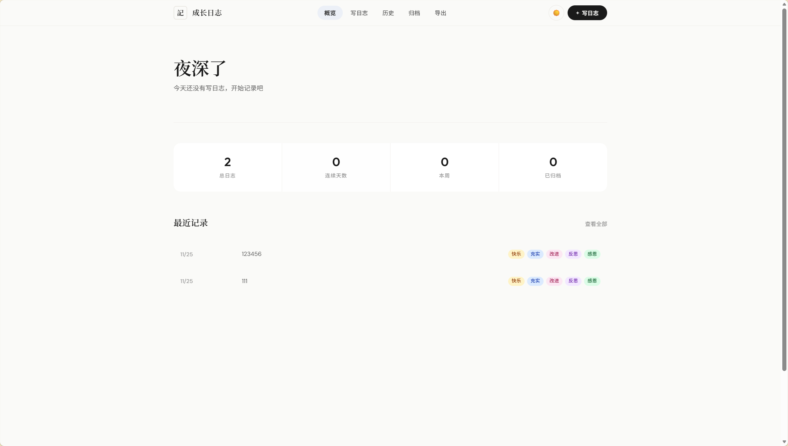
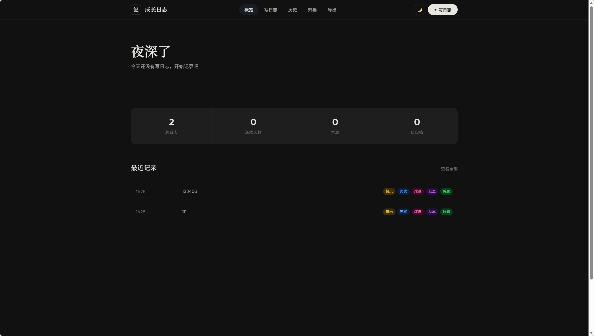

# 🌱 每日成长日志

> Keep growing, day by day.

一款优雅的个人每日复盘与成长记录工具，帮助你养成每日反思的习惯，记录生活中的快乐、充实、改进、反思与感恩。

[](https://opensource.org/licenses/MIT)


---

## 📸 功能预览

| 亮色模式 | 暗色模式 |
|---------|---------|
|  |  |

---

## ✨ 核心功能

### 📝 写日志

- 五维度每日复盘：快乐的事、充实的事、应该改进的事、今日反思、感恩的人
- 日期选择器，支持前后日期快速切换
- 实时字符计数与完成度进度条
- 输入验证与 XSS 防护

### 📊 概览仪表盘

- 智能问候语（根据时段自动切换）
- 连续记录天数统计（🔥 连续打卡）
- 总日志数、本周记录、已归档数量一览
- 最近8条日志快速预览

### 📅 历史记录

- 防抖搜索（300ms 延迟，避免频繁重渲染）
- 分类筛选（快乐/充实/改进/反思）
- 分页浏览（每页20条，支持大数据量）
- 日志详情卡片式阅读模式
- 编辑、归档、删除操作

### 📂 归档管理

- 不常用日志一键归档
- 归档与取消归档灵活切换
- 独立归档浏览页面

### 📤 数据导出与导入

- **CSV 导出**：兼容 Excel/WPS，UTF-8 编码防乱码
- **PDF 导出**：利用浏览器打印功能生成精美 PDF
- **CSV 导入**：从外部 CSV 文件合并数据（自动去重）
- 数据统计概览

### 🌗 主题切换

- 亮色/暗色双模式，一键切换
- 自动跟随系统主题偏好
- 主题选择持久化保存

### 🛡️ 安全特性

- XSS 防护：所有用户内容渲染前 HTML 转义
- 输入验证：日期格式、字段长度、类型检查
- 事件委托：消除 eval 执行模式
- Content Security Policy 纵深防御

---

## 🚀 快速开始

### 环境要求

| 方式         | 环境要求    |
| ------------ | ----------- |
| Vite 前端版  | Node.js 18+ |
| Streamlit 版 | Python 3.8+ |

### 方式一：Vite 开发模式（推荐）

```bash
# 克隆仓库
git clone https://github.com/Linqiyu-0921/MyDailyLog.git
cd MyDailyLog

# 安装依赖
npm install

# 启动开发服务器
npm run dev

# 构建生产版本
npm run build
npm run preview
```

> 浏览器打开 `http://localhost:8080`

### 方式二：Streamlit 应用

```bash
# 安装依赖
pip install streamlit pandas

# 启动应用
streamlit run streamlit/app.py
```

> 浏览器自动打开 `http://localhost:8501`

### 方式三：纯静态部署

```bash
npm run build
```

将 `dist/` 目录部署到 GitHub Pages、Vercel、Netlify 等静态托管服务。

---

## 🧪 测试

```bash
# 运行所有测试
npm test

# 监听模式（开发时使用）
npm run test:watch

# 生成覆盖率报告
npm run test:coverage
```

**当前测试状态：79/79 通过**，覆盖单元测试、集成测试和性能测试。

---

## 🗂️ 项目结构

```
MyDailyLog/
├── index.html              # Vite 入口（最小化 HTML 壳）
├── package.json            # Node.js 项目配置
├── vite.config.js          # Vite 构建配置
├── src/
│   ├── main.js             # 应用入口 + 全局事件委托
│   ├── router.js            # SPA 路由管理
│   ├── store.js             # 数据存储层（CRUD + 内存缓存）
│   ├── csv.js               # CSV 导入/导出
│   ├── sanitize.js          # XSS 防护 + 输入验证
│   ├── utils.js             # 通用工具（日期/ID/防抖/分页）
│   ├── theme.js             # 主题管理
│   ├── components.js        # 可复用 UI 组件
│   ├── pages/
│   │   ├── dashboard.js     # 概览页
│   │   ├── write.js         # 写日志页
│   │   ├── history.js       # 历史记录页
│   │   ├── detail.js        # 详情页
│   │   ├── archive.js       # 归档页
│   │   └── export.js        # 导出页
│   └── styles/
│       └── main.css         # 全局样式（CSS 变量体系）
├── tests/
│   ├── unit/                # 单元测试（58 个用例）
│   ├── integration/         # 集成测试（5 个用例）
│   └── performance/         # 性能测试（7 个用例）
├── streamlit/
│   └── app.py               # Streamlit 版本
├── data/
│   └── my_daily_log.csv     # 示例数据
├── docs/
│   ├── architecture.md      # 架构文档
│   ├── tech-stack.md        # 技术选型说明
│   ├── implementation.md    # 实施步骤指南
│   └── test-report.md       # 测试报告
├── .gitignore
└── README.md
```

---

## 🛠️ 技术栈

### 前端技术

| 分类     | 技术          | 说明                        |
| -------- | ------------- | --------------------------- |
| 构建工具 | Vite 6.x      | HMR、代码分割、Tree-shaking |
| 模块化   | ES Modules    | 原生模块化，消除全局污染    |
| 测试框架 | Vitest 3.x    | 与 Vite 共享配置的 ESM 测试 |
| 数据存储 | localStorage  | 浏览器本地存储 + 内存缓存   |
| 样式     | CSS Variables | 双主题支持                  |

### 后端技术（可选）

| 分类     | 技术      | 说明                |
| -------- | --------- | ------------------- |
| Web 框架 | Streamlit | Python 数据应用框架 |
| 数据格式 | CSV       | 轻量级数据存储      |

### 安全技术

- **XSS 防护**：HTML 转义 + 输入验证
- **事件委托**：消除 eval 和内联事件
- **CSP 策略**：Content Security Policy 纵深防御

---

## 📋 项目里程碑

| 时间    | 里程碑            | 说明                                                                                                                                             |
| ------- | ----------------- | ------------------------------------------------------------------------------------------------------------------------------------------------ |
| 2025-11 | 项目初始化        | 基于 Streamlit + CSV 搭建首个可运行版本                                                                                                          |
| 2025-11 | 技术选型转向      | 从 Streamlit 转向纯前端 SPA，零依赖部署                                                                                                          |
| 2025-11 | 核心功能完善      | 五维度表单、日期导航、字符计数、完成度进度条                                                                                                     |
| 2025-11 | 数据管理增强      | 归档、搜索、筛选、CSV 导入导出                                                                                                                   |
| 2025-11 | UI/UX 重构        | 编辑式排版设计语言，亮暗双主题，响应式布局                                                                                                       |
| 2026-04 | 项目整理          | 重组目录结构，分离模块与数据文件                                                                                                                 |
| 2026-04 | **架构升级 v2.0** | Vite + ES Modules 模块化重构；XSS 防护 + 输入验证安全加固；搜索防抖 + 分页性能优化；Vitest 测试体系（79 用例）；Streamlit 版本缓存与错误处理改进 |

### v2.0 架构升级技术选型

- **Vite 6.x**：替代单体 HTML，提供 HMR、代码分割、Tree-shaking
- **ES Modules**：模块化拆分，消除全局命名空间污染
- **事件委托**：`data-action` + `addEventListener` 替代 `onclick` eval 模式
- **双层安全**：输入验证（sanitize.js）+ 输出转义（components.js）
- **内存缓存**：store.js 缓存层减少 localStorage JSON 解析开销
- **Vitest**：与 Vite 共享配置的 ESM 原生测试框架

---

## 🤝 贡献指南

欢迎提交 Issue 和 Pull Request！

### 开发流程

1. Fork 本仓库
2. 创建功能分支：`git checkout -b feature/your-feature`
3. 运行测试确保通过：`npm test`
4. 提交更改：`git commit -m 'Add some feature'`
5. 推送分支：`git push origin feature/your-feature`
6. 提交 Pull Request

### 开发建议

- 修改页面逻辑：编辑 `src/pages/*.js`
- 修改数据操作：编辑 `src/store.js` 或 `src/csv.js`
- 修改样式：编辑 `src/styles/main.css`，CSS 变量定义在 `:root` 和 `[data-theme="dark"]`
- 修改安全逻辑：编辑 `src/sanitize.js`
- 添加新页面：创建 `src/pages/newpage.js`，在 `main.js` 中注册

---

## 📖 相关文档

| 文档                                 | 说明                  |
| ------------------------------------ | --------------------- |
| [架构文档](./docs/architecture.md)   | 系统架构设计详解      |
| [技术选型](./docs/tech-stack.md)     | 技术选型理由与对比    |
| [实施指南](./docs/implementation.md) | 功能实现步骤指南      |
| [测试报告](./docs/test-report.md)    | 79 个测试用例详细报告 |

---

## 📮 联系方式

- 提交 [GitHub Issue](https://github.com/Linqiyu-0921/MyDailyLog/issues)
- 发起 [GitHub Discussion](https://github.com/Linqiyu-0921/MyDailyLog/discussions)

如果你觉得这个项目对你有帮助，欢迎 ⭐ Star！

---

## 📄 许可证

本项目基于 [MIT License](https://opensource.org/licenses/MIT) 开源。
